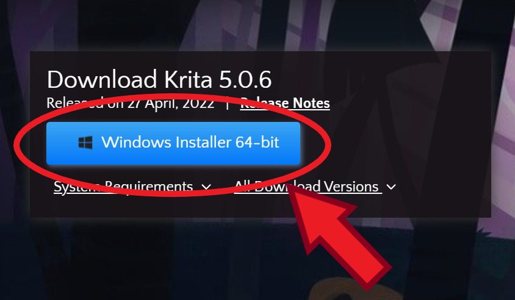
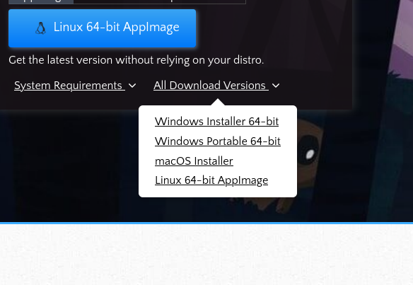

# 安装Krita

## Windows / MacOS / Linux AppImage

1. 进入[Krita官网](https://krita.org/)；

2. 点击“Download”（软件下载）或“GET KRITA NOW”（免费下载KRITA）；


3. 点击蓝色按钮（Windows显示“Windows Installer”，MacOS显示“dmg”，Linux显示“AppImage”）；



如果想要下载其他版本，点击“All Download Versions”；



4. 安装离线安装包（如果是AppImage可以直接运行）。

## Winget (Windows 10/11)

```powershell
winget install KDE.Krita
```

## Chocolatey (Windows)

```powershell
choco install krita
```

## Linux

### Arch Linux / EndeavourOS

```bash
sudo pacman -S krita
```

### Snap

```bash
sudo snap install krita

# Candidate version
sudo snap install krita --candidate
```

### Flatpak

```bash
sudo flatpak install flathub org.kde.krita
```

更多详情： https://krita.org/
